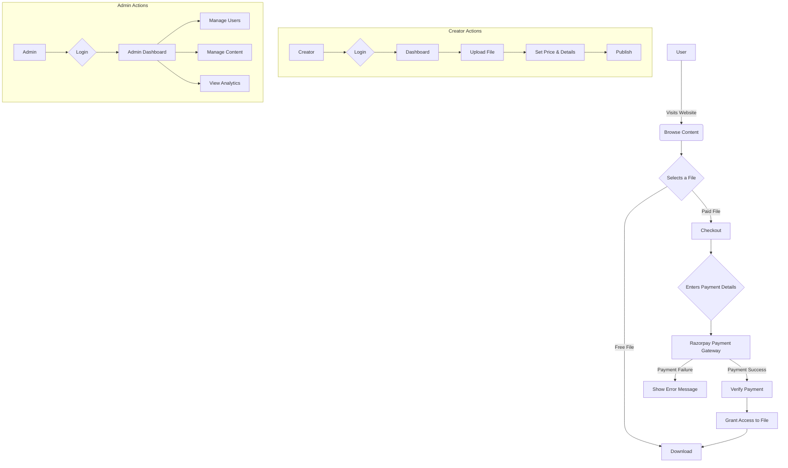

## 5. Frontend

### 5.1. Views and Templating

The frontend is built using EJS (Embedded JavaScript) for server-side rendering. The views are located in the `views/` directory. The application uses a consistent layout with a header (`header.ejs`) and footer (`footer.ejs`) included in most pages. This approach allows for reusable UI components and a consistent look and feel across the application.

The views are responsible for displaying the data to the user. They receive data from the controllers and render it into HTML. The EJS templates allow for embedding JavaScript code, which makes it easy to generate dynamic content. For example, the `index.ejs` view iterates over a list of files and renders a file card for each one.

### 5.2. Client-side Logic

Client-side JavaScript is used for interactivity, such as handling form submissions, real-time chat, and dynamic UI updates. The client-side JavaScript files are located in the `public/js/` directory.

The client-side JavaScript code interacts with the backend API to fetch data and perform actions. For example, the `user-login.js` file handles the client-side logic for the user login form. It sends an AJAX request to the backend to authenticate the user and then updates the UI based on the response.

The application also uses JavaScript for the real-time chat functionality. The client-side code establishes a WebSocket connection with the server and then sends and receives chat messages in real-time.

## 6. Key Features

### 6.1. File Upload and Management

*   **Secure File Uploads**: Files are uploaded to AWS S3, ensuring scalability and security. The application uses pre-signed URLs to allow clients to upload files directly to S3, which reduces the load on the server and improves performance.
*   **Content Delivery Network (CDN)**: AWS CloudFront is used for fast and secure content delivery. This ensures that users can download files quickly and reliably, regardless of their location.
*   **File Metadata**: The application stores file metadata, such as filename, description, price, and category, in the MongoDB database. This allows for easy searching and filtering of files.
*   **Admin Dashboard**: The admin dashboard provides a UI for managing uploaded files, including editing and deleting them. Admins can also view analytics for each file, such as the number of downloads.

### 6.2. Payment Integration

*   **Razorpay Integration**: The application is integrated with Razorpay for processing payments. Razorpay provides a seamless and secure way to handle online payments, with support for various payment methods.
*   **Order Management**: The application creates and manages orders, and verifies payments. When a user makes a purchase, a new order is created in the database. The application then verifies the payment with Razorpay and updates the order status accordingly.
*   **Secure Transactions**: The payment verification process uses cryptographic signatures to ensure the integrity of the transactions. This prevents tampering and ensures that only valid payments are processed.

### 6.3. Course Management

*   **Course Creation**: Creators can create courses with modules and submodules. The course creation process is guided by a multi-step form that allows creators to add all the necessary information, such as the course title, description, price, and category.
*   **Content Upload**: Course content, such as videos and documents, can be uploaded to AWS S3. The application uses pre-signed URLs for secure and efficient file uploads.
*   **User Progress Tracking**: The application tracks user progress in courses. It records which lessons the user has completed and their progress in each lesson.

### 6.4. Chat System

*   **Real-time Chat**: The application includes a real-time chat system built with WebSockets. This allows for instant communication between users.
*   **Private Messaging**: Users can send private messages to each other. The chat system supports one-on-one conversations.
*   **Typing Indicators**: The chat system includes typing indicators to show when a user is typing. This improves the user experience by providing real-time feedback.

### 6.5. User and Admin Dashboards

*   **User Dashboard**: Users have a dashboard where they can view their purchased content, download history, and manage their profile. The dashboard provides a centralized location for users to access all their information and content.
*   **Admin Dashboard**: The admin dashboard provides a comprehensive overview of the application, including order history, uploaded files, and user management. Admins can use the dashboard to monitor the application, manage content, and assist users.

## 7. Security

*   **Password Hashing**: Passwords are hashed using `bcrypt` before being stored in the database. This prevents attackers from being able to read the passwords even if they gain access to the database.
*   **Authentication**: User authentication is handled using JWTs, which are a secure way to transmit information between parties.
*   **Authorization**: The application uses middleware to protect routes that require authentication. This ensures that only authenticated users can access certain parts of the application.
*   **Input Sanitization**: The application uses the `xss` library to sanitize user input and prevent Cross-Site Scripting (XSS) attacks.
*   **Secure Headers**: The application uses the `helmet` middleware to set various HTTP headers that help to secure the application.
*   **Rate Limiting**: The application uses the `express-rate-limit` middleware to prevent brute-force attacks.

## 8. Deployment and DevOps

While the specific deployment configuration is not included in the project files, here is a possible deployment strategy based on the project's structure and dependencies:

*   **Containerization**: The application can be containerized using Docker. This would allow for a consistent and reproducible deployment environment.
*   **Continuous Integration/Continuous Deployment (CI/CD)**: A CI/CD pipeline can be set up using a tool like Jenkins, GitLab CI, or GitHub Actions. This would automate the process of building, testing, and deploying the application.
*   **Hosting**: The application can be hosted on a cloud platform like AWS, Google Cloud, or Microsoft Azure. The application would be deployed to a cluster of servers, with a load balancer to distribute traffic between them.
*   **Database**: The MongoDB database can be hosted on a managed database service like MongoDB Atlas.
*   **File Storage**: The application is already configured to use AWS S3 for file storage.

## 9. Flowchart

This flowchart illustrates the main user flows in the application, from browsing content to making a purchase, as well as the actions available to creators and admins.

